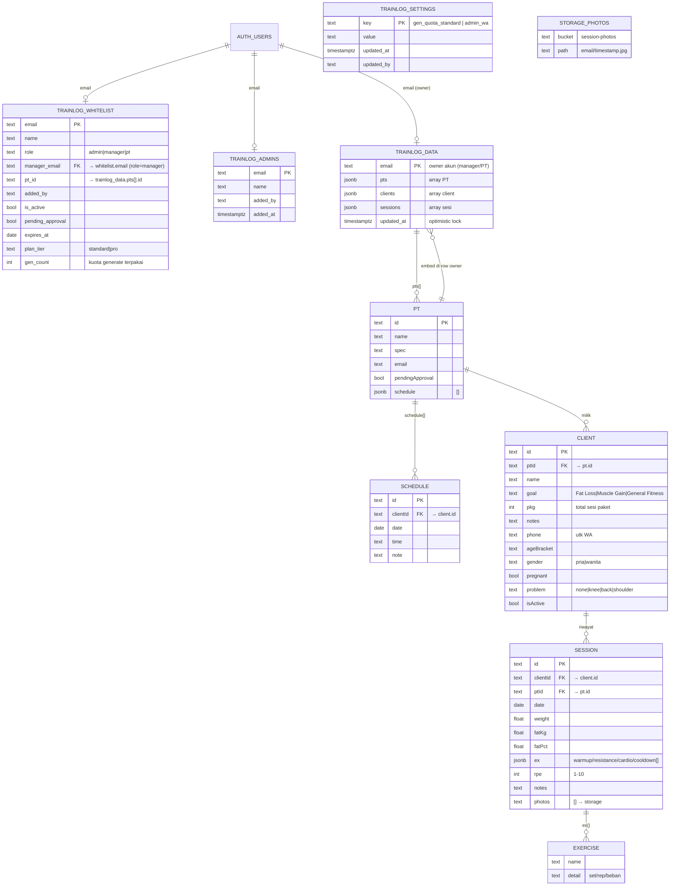

# ERD TrainLog

Direkonstruksi dari kode app (`app_trainlog.id`, analisa 2026-09-18). Bukan skema SQL asli — `trainlog_data` memakai pola **document/JSONB** (array objek dalam 1 row per akun), relasi antar-entity lewat `id` di dalam JSON.

## Diagram (Mermaid)



## Versi teks (tanpa Mermaid)

```
auth.users (Supabase Auth)
   email ──1:1── trainlog_whitelist        (akses: role, tier, expiry, aktif)
   email ──1:1── trainlog_admins           (superuser)
   email ──1:1── trainlog_data             (row data milik akun)

trainlog_data (1 row per akun manager/PT)
 ├─ pts[]      : PT      {id, name, spec, email, pendingApproval, schedule[]}
 ├─ clients[]  : Client  {id, ptId→pts[].id, name, goal, pkg, notes, phone,
 │                        ageBracket, gender, pregnant, problem, isActive}
 └─ sessions[] : Session {id, clientId→clients[].id, ptId→pts[].id, date,
                          weight, fatKg, fatPct, rpe, notes,
                          ex{warmup[],resistance[],cardio[],cooldown[]},
                          photos[] → storage bucket "session-photos"}

trainlog_whitelist
 ├─ manager_email → trainlog_whitelist.email (role=manager)
 └─ pt_id         → trainlog_data.pts[].id

trainlog_settings : {key: gen_quota_standard|admin_wa, value, updated_at, updated_by}

Storage: bucket session-photos, path = <owner-email>/<ts>_<rand>.jpg
Edge Functions: create-account, change-email, ai-proxy, generate-program
```

## Catatan desain

- **Document-store di atas RDBMS**: seluruh bisnis data (PT/client/sesi/jadwal) disimpan sebagai 3 array JSONB dalam 1 row per akun. Write = upsert row penuh + `updated_at` sebagai optimistic lock. Sederhana (tanpa join/migrasi), tapi: row membesar linear dengan jumlah sesi, konflik tulis = last-write-wins per akun, tidak bisa query lintas akun via PostgREST (dilakukan di client).
- **Relasi nyata hanya via email**: auth ↔ whitelist ↔ data ↔ admins. `manager_email` di whitelist = hierarki manager→PT.
- **Foto tidak di tabel** — hanya nama path di `session.photos[]`, file di Supabase Storage.
- Jadwal menempel di objek PT (`pt.schedule[]`), bukan entity tabel terpisah.
- Kalau mau desain ulang relasional: pecah `pts/clients/sessions/schedule` jadi tabel sendiri dengan FK + RLS per `owner_email` — hilangkan optimistic-lock row penuh.
