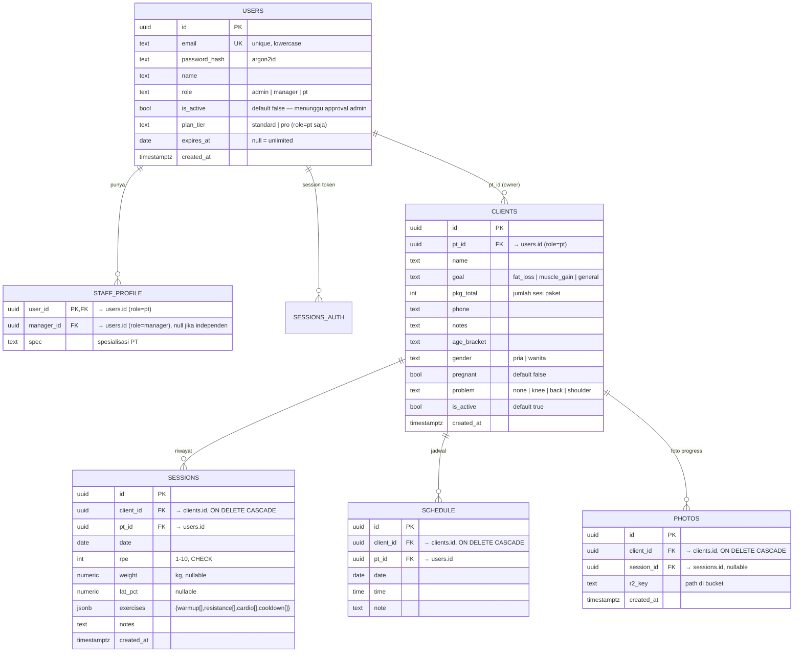

# ERD — TrainLog Replica (Redisain Relasional)

Pengembangan dari `erd-asli.md` (rekonstruksi TrainLog asli, document-store). Di sini dipecah jadi tabel relasional Postgres dengan FK — menghilangkan write row-penuh + optimistic lock.

## Diagram



## Index (WAJIB sebelum tunjangan read habis)

```sql
CREATE INDEX idx_clients_pt      ON clients(pt_id);
CREATE INDEX idx_sessions_client ON sessions(client_id, date DESC);
CREATE INDEX idx_sessions_pt     ON sessions(pt_id, date DESC);
CREATE INDEX idx_schedule_range  ON schedule(pt_id, date);
CREATE INDEX idx_photos_client   ON photos(client_id);
```

## Aturan akses (lapisan Hono, pengganti RLS)

1. **Ownership**: semua query bawa `WHERE pt_id = currentUser.id` — kecuali:
2. **Manager**: boleh read semua PT dengan `staff_profile.manager_id = manager.id`; write tetap milik PT
3. **Admin**: read semua
4. **Grace mode**: `expires_at < now()` dan `≤ 14 hari` → hanya GET; > 14 hari → 402/tolak login
5. **Aktivasi**: `is_active = false` → login ditolak dengan pesan "menunggu verifikasi"

## Kenapa beda dari aslinya

| Asli (JSONB 1-row) | Replica (relasional) |
|---|---|
| Write = upsert row penuh (ratusan KB) | Write = 1 row yang berubah |
| Optimistic lock manual `updated_at` | FK + constraint DB |
| Query lintas akun = fetch semua row | SQL join biasa |
| Duplikasi data PT di row manager | `manager_id` tunggal |
| Boro row read (PostgREST count all) | Query terindeks presisi |
